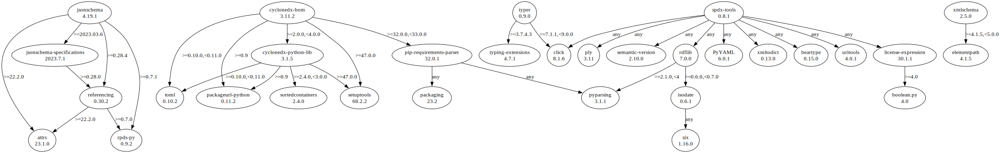

# Third Party Dependencies

<!--[[[fill sbom_sha256()]]]-->
The [SBOM in CycloneDX v1.4 JSON format](https://git.sr.ht/~sthagen/sbom/blob/default/etc/sbom/cdx.json) with SHA256 checksum ([94e39819 ...](https://git.sr.ht/~sthagen/sbom/blob/default/etc/sbom/cdx.json.sha256 "sha256:94e398191ae083146f89dc47bc6dc4f8e22356ecff91959fd076107cb6cee8db")).
<!--[[[end]]] (checksum: 5ec17ca048329e435eca8ca842ab7c9c)-->
## Licenses 

JSON files with complete license info of: [direct dependencies](direct-dependency-licenses.json) | [all dependencies](all-dependency-licenses.json)

### Direct Dependencies

<!--[[[fill direct_dependencies_table()]]]-->
| Name                                                                   | Version                                                  | License                 | Author                                     | Description (from packaging data)                                  |
|:-----------------------------------------------------------------------|:---------------------------------------------------------|:------------------------|:-------------------------------------------|:-------------------------------------------------------------------|
| [attrs](https://www.attrs.org/en/stable/changelog.html)                | [23.1.0](https://pypi.org/project/attrs/23.1.0/)         | MIT License             | Hynek Schlawack <hs@ox.cx>                 | Classes Without Boilerplate                                        |
| [cyclonedx-bom](https://github.com/CycloneDX/cyclonedx-python/#readme) | [3.11.7](https://pypi.org/project/cyclonedx-bom/3.11.7/) | Apache Software License | Steven Springett                           | CycloneDX Software Bill of Materials (SBOM) generation utility     |
| [jsonschema](https://github.com/python-jsonschema/jsonschema)          | [4.20.0](https://pypi.org/project/jsonschema/4.20.0/)    | MIT License             | Julian Berman                              | An implementation of JSON Schema validation for Python             |
| [referencing](https://github.com/python-jsonschema/referencing)        | [0.32.0](https://pypi.org/project/referencing/0.32.0/)   | MIT License             | Julian Berman                              | JSON Referencing + Python                                          |
| [spdx-tools](https://github.com/spdx/tools-python)                     | [0.8.2](https://pypi.org/project/spdx-tools/0.8.2/)      | Apache Software License | "Ahmed H. Ismail" <ahm3d.hisham@gmail.com> | SPDX parser and tools.                                             |
| [typer](https://github.com/tiangolo/typer)                             | [0.9.0](https://pypi.org/project/typer/0.9.0/)           | MIT License             | Sebastián Ramírez                          | Typer, build great CLIs. Easy to code. Based on Python type hints. |
| [xmlschema](https://github.com/sissaschool/xmlschema)                  | [2.5.1](https://pypi.org/project/xmlschema/2.5.1/)       | MIT License             | Davide Brunato                             | An XML Schema validator and decoder                                |
<!--[[[end]]] (checksum: b95faa0876d0c31792ef37bb3de01bc8)-->

### Indirect Dependencies

<!--[[[fill indirect_dependencies_table()]]]-->
| Name                                                                       | Version                                                            | License                              | Author                                      | Description (from packaging data)                                                                             |
|:---------------------------------------------------------------------------|:-------------------------------------------------------------------|:-------------------------------------|:--------------------------------------------|:--------------------------------------------------------------------------------------------------------------|
| [PyYAML](https://pyyaml.org/)                                              | [6.0.1](https://pypi.org/project/PyYAML/6.0.1/)                    | MIT License                          | Kirill Simonov                              | YAML parser and emitter for Python                                                                            |
| [click](https://palletsprojects.com/p/click/)                              | [8.1.6](https://pypi.org/project/click/8.1.6/)                     | BSD License                          | Pallets <contact@palletsprojects.com>       | Composable command line interface toolkit                                                                     |
| [cyclonedx-python-lib](https://github.com/CycloneDX/cyclonedx-python-lib)  | [3.1.5](https://pypi.org/project/cyclonedx-python-lib/3.1.5/)      | Apache Software License              | Paul Horton                                 | A library for producing CycloneDX SBOM (Software Bill of Materials) files.                                    |
| [elementpath](https://github.com/sissaschool/elementpath)                  | [4.1.5](https://pypi.org/project/elementpath/4.1.5/)               | MIT License                          | Davide Brunato                              | XPath 1.0/2.0/3.0/3.1 parsers and selectors for ElementTree and lxml                                          |
| [isodate](https://github.com/gweis/isodate/)                               | [0.6.1](https://pypi.org/project/isodate/0.6.1/)                   | BSD License                          | Gerhard Weis                                | An ISO 8601 date/time/duration parser and formatter                                                           |
| [packageurl-python](https://github.com/package-url/packageurl-python)      | [0.11.2](https://pypi.org/project/packageurl-python/0.11.2/)       | MIT License                          | the purl authors                            | A purl aka. Package URL parser and builder                                                                    |
| [packaging](https://github.com/pypa/packaging)                             | [23.2](https://pypi.org/project/packaging/23.2/)                   | Apache Software License; BSD License | Donald Stufft <donald@stufft.io>            | Core utilities for Python packages                                                                            |
| [pip-requirements-parser](https://github.com/nexB/pip-requirements-parser) | [32.0.1](https://pypi.org/project/pip-requirements-parser/32.0.1/) | MIT                                  | The pip authors, nexB. Inc. and others      | pip requirements parser - a mostly correct pip requirements parsing library because it uses pip's own code.   |
| [ply](http://www.dabeaz.com/ply/)                                          | [3.11](https://pypi.org/project/ply/3.11/)                         | BSD                                  | David Beazley                               | Python Lex & Yacc                                                                                             |
| [pyparsing](https://github.com/pyparsing/pyparsing/)                       | [3.1.1](https://pypi.org/project/pyparsing/3.1.1/)                 | MIT License                          | Paul McGuire <ptmcg.gm+pyparsing@gmail.com> | pyparsing module - Classes and methods to define and execute parsing grammars                                 |
| [rdflib](https://github.com/RDFLib/rdflib)                                 | [7.0.0](https://pypi.org/project/rdflib/7.0.0/)                    | BSD License                          | Daniel 'eikeon' Krech                       | RDFLib is a Python library for working with RDF, a simple yet powerful language for representing information. |
| [setuptools](https://github.com/pypa/setuptools)                           | [69.0.2](https://pypi.org/project/setuptools/69.0.2/)              | MIT License                          | Python Packaging Authority                  | Easily download, build, install, upgrade, and uninstall Python packages                                       |
| [six](https://github.com/benjaminp/six)                                    | [1.16.0](https://pypi.org/project/six/1.16.0/)                     | MIT License                          | Benjamin Peterson                           | Python 2 and 3 compatibility utilities                                                                        |
| [sortedcontainers](http://www.grantjenks.com/docs/sortedcontainers/)       | [2.4.0](https://pypi.org/project/sortedcontainers/2.4.0/)          | Apache Software License              | Grant Jenks                                 | Sorted Containers -- Sorted List, Sorted Dict, Sorted Set                                                     |
| [toml](https://github.com/uiri/toml)                                       | [0.10.2](https://pypi.org/project/toml/0.10.2/)                    | MIT License                          | William Pearson                             | Python Library for Tom's Obvious, Minimal Language                                                            |
| [xmltodict](https://github.com/martinblech/xmltodict)                      | [0.13.0](https://pypi.org/project/xmltodict/0.13.0/)               | MIT License                          | Martin Blech                                | Makes working with XML feel like you are working with JSON                                                    |
<!--[[[end]]] (checksum: d0e6de64ae8a9d2b27a4449cc787733e)-->

## Dependency Tree(s)

JSON file with the complete package dependency tree info of: [the full dependency tree](package-dependency-tree.json)

### Rendered SVG

Base graphviz file in dot format: [Trees of the direct dependencies](package-dependency-tree.dot.txt)



### Console Representation

<!--[[[fill dependency_tree_console_text()]]]-->
````console
cyclonedx-bom==3.11.7
├── chardet [required: >=5.0,<6.0, installed: 5.2.0]
├── cyclonedx-python-lib [required: >=2.0.0,<4.0.0, installed: 3.1.5]
│   ├── packageurl-python [required: >=0.9, installed: 0.11.2]
│   ├── setuptools [required: >=47.0.0, installed: 69.0.2]
│   ├── sortedcontainers [required: >=2.4.0,<3.0.0, installed: 2.4.0]
│   └── toml [required: >=0.10.0,<0.11.0, installed: 0.10.2]
├── packageurl-python [required: >=0.9, installed: 0.11.2]
├── pip-requirements-parser [required: >=32.0.0,<33.0.0, installed: 32.0.1]
│   ├── packaging [required: Any, installed: 23.2]
│   └── pyparsing [required: Any, installed: 3.1.1]
├── setuptools [required: >=47.0.0, installed: 69.0.2]
└── toml [required: >=0.10.0,<0.11.0, installed: 0.10.2]
jsonschema==4.20.0
├── attrs [required: >=22.2.0, installed: 23.1.0]
├── jsonschema-specifications [required: >=2023.03.6, installed: 2023.7.1]
│   └── referencing [required: >=0.28.0, installed: 0.32.0]
│       ├── attrs [required: >=22.2.0, installed: 23.1.0]
│       └── rpds-py [required: >=0.7.0, installed: 0.9.2]
├── referencing [required: >=0.28.4, installed: 0.32.0]
│   ├── attrs [required: >=22.2.0, installed: 23.1.0]
│   └── rpds-py [required: >=0.7.0, installed: 0.9.2]
└── rpds-py [required: >=0.7.1, installed: 0.9.2]
spdx-tools==0.8.2
├── beartype [required: Any, installed: 0.15.0]
├── click [required: Any, installed: 8.1.6]
├── license-expression [required: Any, installed: 30.1.1]
│   └── boolean.py [required: >=4.0, installed: 4.0]
├── ply [required: Any, installed: 3.11]
├── PyYAML [required: Any, installed: 6.0.1]
├── rdflib [required: Any, installed: 7.0.0]
│   ├── isodate [required: >=0.6.0,<0.7.0, installed: 0.6.1]
│   │   └── six [required: Any, installed: 1.16.0]
│   └── pyparsing [required: >=2.1.0,<4, installed: 3.1.1]
├── semantic-version [required: Any, installed: 2.10.0]
├── uritools [required: Any, installed: 4.0.1]
└── xmltodict [required: Any, installed: 0.13.0]
typer==0.9.0
├── click [required: >=7.1.1,<9.0.0, installed: 8.1.6]
└── typing-extensions [required: >=3.7.4.3, installed: 4.7.1]
xmlschema==2.5.1
└── elementpath [required: >=4.1.5,<5.0.0, installed: 4.1.5]
````
<!--[[[end]]] (checksum: 5f20831c95cade800dae2421a084641c)-->
