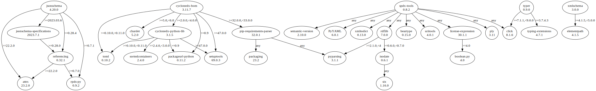

# Third Party Dependencies

<!--[[[fill sbom_sha256()]]]-->
The [SBOM in CycloneDX v1.4 JSON format](https://github.com/sthagen/pilli/blob/default/sbom.json) with SHA256 checksum ([fe4ebdd0 ...](https://raw.githubusercontent.com/sthagen/pilli/default/sbom.json.sha256 "sha256:fe4ebdd049a2465600d6aa9f8f8c987024dfa89bf5c3bff5ad7c751a203595e2")).
<!--[[[end]]] (checksum: 5d5cb3c8bd0a64223547d1ca32a45084)-->
## Licenses 

JSON files with complete license info of: [direct dependencies](direct-dependency-licenses.json) | [all dependencies](all-dependency-licenses.json)

### Direct Dependencies

<!--[[[fill direct_dependencies_table()]]]-->
| Name                                                                               | Version                                                  | License                 | Author            | Description (from packaging data)                                  |
|:-----------------------------------------------------------------------------------|:---------------------------------------------------------|:------------------------|:------------------|:-------------------------------------------------------------------|
| [attrs](https://www.attrs.org/)                                                    | [22.2.0](https://pypi.org/project/attrs/22.2.0/)         | MIT License             | Hynek Schlawack   | Classes Without Boilerplate                                        |
| [cyclonedx-bom](https://github.com/CycloneDX/cyclonedx-python/#readme)             | [3.10.1](https://pypi.org/project/cyclonedx-bom/3.10.1/) | Apache Software License | Steven Springett  | CycloneDX Software Bill of Materials (SBOM) generation utility     |
| [jsonschema](https://github.com/python-jsonschema/jsonschema/blob/main/README.rst) | [4.17.3](https://pypi.org/project/jsonschema/4.17.3/)    | MIT License             | Julian Berman     | An implementation of JSON Schema validation for Python             |
| [spdx-tools](https://github.com/spdx/tools-python)                                 | [0.6.1](https://pypi.org/project/spdx-tools/0.6.1/)      | Apache Software License | Ahmed H. Ismail   | SPDX parser and tools.                                             |
| [typer](https://github.com/tiangolo/typer)                                         | [0.7.0](https://pypi.org/project/typer/0.7.0/)           | MIT License             | Sebastián Ramírez | Typer, build great CLIs. Easy to code. Based on Python type hints. |
| [xmlschema](https://github.com/sissaschool/xmlschema)                              | [2.1.1](https://pypi.org/project/xmlschema/2.1.1/)       | MIT License             | Davide Brunato    | An XML Schema validator and decoder                                |
<!--[[[end]]] (checksum: fc07eb15b0b389b173d207101bedc822)-->

### Indirect Dependencies

<!--[[[fill indirect_dependencies_table()]]]-->
| Name                                                                       | Version                                                            | License                              | Author                                    | Description (from packaging data)                                                                             |
|:---------------------------------------------------------------------------|:-------------------------------------------------------------------|:-------------------------------------|:------------------------------------------|:--------------------------------------------------------------------------------------------------------------|
| [PyYAML](https://pyyaml.org/)                                              | [6.0](https://pypi.org/project/PyYAML/6.0/)                        | MIT License                          | Kirill Simonov                            | YAML parser and emitter for Python                                                                            |
| [click](https://palletsprojects.com/p/click/)                              | [8.1.3](https://pypi.org/project/click/8.1.3/)                     | BSD License                          | Armin Ronacher                            | Composable command line interface toolkit                                                                     |
| [cyclonedx-python-lib](https://github.com/CycloneDX/cyclonedx-python-lib)  | [3.1.1](https://pypi.org/project/cyclonedx-python-lib/3.1.1/)      | Apache Software License              | Paul Horton                               | A library for producing CycloneDX SBOM (Software Bill of Materials) files.                                    |
| [elementpath](https://github.com/sissaschool/elementpath)                  | [3.0.2](https://pypi.org/project/elementpath/3.0.2/)               | MIT License                          | Davide Brunato                            | XPath 1.0/2.0/3.0 parsers and selectors for ElementTree and lxml                                              |
| [isodate](https://github.com/gweis/isodate/)                               | [0.6.1](https://pypi.org/project/isodate/0.6.1/)                   | BSD License                          | Gerhard Weis                              | An ISO 8601 date/time/duration parser and formatter                                                           |
| [packageurl-python](https://github.com/package-url/packageurl-python)      | [0.10.4](https://pypi.org/project/packageurl-python/0.10.4/)       | MIT License                          | the purl authors                          | A purl aka. Package URL parser and builder                                                                    |
| [packaging](https://github.com/pypa/packaging)                             | [21.3](https://pypi.org/project/packaging/21.3/)                   | Apache Software License; BSD License | Donald Stufft and individual contributors | Core utilities for Python packages                                                                            |
| [pip-requirements-parser](https://github.com/nexB/pip-requirements-parser) | [32.0.1](https://pypi.org/project/pip-requirements-parser/32.0.1/) | MIT                                  | The pip authors, nexB. Inc. and others    | pip requirements parser - a mostly correct pip requirements parsing library because it uses pip's own code.   |
| [ply](http://www.dabeaz.com/ply/)                                          | [3.11](https://pypi.org/project/ply/3.11/)                         | BSD                                  | David Beazley                             | Python Lex & Yacc                                                                                             |
| [pyparsing](https://github.com/pyparsing/pyparsing/blob/master/README.rst) | [3.0.9](https://pypi.org/project/pyparsing/3.0.9/)                 | MIT License                          | Paul McGuire                              | pyparsing module - Classes and methods to define and execute parsing grammars                                 |
| [pyrsistent](https://github.com/tobgu/pyrsistent/)                         | [0.19.2](https://pypi.org/project/pyrsistent/0.19.2/)              | MIT License                          | Tobias Gustafsson                         | Persistent/Functional/Immutable data structures                                                               |
| [rdflib](https://github.com/RDFLib/rdflib)                                 | [6.2.0](https://pypi.org/project/rdflib/6.2.0/)                    | BSD License                          | Daniel 'eikeon' Krech                     | RDFLib is a Python library for working with RDF, a simple yet powerful language for representing information. |
| [setuptools](https://github.com/pypa/setuptools)                           | [65.6.3](https://pypi.org/project/setuptools/65.6.3/)              | MIT License                          | Python Packaging Authority                | Easily download, build, install, upgrade, and uninstall Python packages                                       |
| [six](https://github.com/benjaminp/six)                                    | [1.16.0](https://pypi.org/project/six/1.16.0/)                     | MIT License                          | Benjamin Peterson                         | Python 2 and 3 compatibility utilities                                                                        |
| [sortedcontainers](http://www.grantjenks.com/docs/sortedcontainers/)       | [2.4.0](https://pypi.org/project/sortedcontainers/2.4.0/)          | Apache Software License              | Grant Jenks                               | Sorted Containers -- Sorted List, Sorted Dict, Sorted Set                                                     |
| [toml](https://github.com/uiri/toml)                                       | [0.10.2](https://pypi.org/project/toml/0.10.2/)                    | MIT License                          | William Pearson                           | Python Library for Tom's Obvious, Minimal Language                                                            |
| [xmltodict](https://github.com/martinblech/xmltodict)                      | [0.13.0](https://pypi.org/project/xmltodict/0.13.0/)               | MIT License                          | Martin Blech                              | Makes working with XML feel like you are working with JSON                                                    |
<!--[[[end]]] (checksum: 796dc91b1febe5c2dc4454df2fccaff7)-->

## Dependency Tree(s)

JSON file with the complete package dependency tree info of: [the full dependency tree](package-dependency-tree.json)

### Rendered SVG

Base graphviz file in dot format: [Trees of the direct dependencies](package-dependency-tree.dot.txt)



### Console Representation

<!--[[[fill dependency_tree_console_text()]]]-->
````console
cyclonedx-bom==3.10.1
  - cyclonedx-python-lib [required: >=2.0.0,<4.0.0, installed: 3.1.1]
    - packageurl-python [required: >=0.9, installed: 0.10.4]
    - setuptools [required: >=47.0.0, installed: 65.6.3]
    - sortedcontainers [required: >=2.4.0,<3.0.0, installed: 2.4.0]
    - toml [required: >=0.10.0,<0.11.0, installed: 0.10.2]
  - packageurl-python [required: >=0.9, installed: 0.10.4]
  - pip-requirements-parser [required: >=32.0.0,<33.0.0, installed: 32.0.1]
    - packaging [required: Any, installed: 21.3]
      - pyparsing [required: >=2.0.2,!=3.0.5, installed: 3.0.9]
    - pyparsing [required: Any, installed: 3.0.9]
  - setuptools [required: >=47.0.0, installed: 65.6.3]
  - toml [required: >=0.10.0,<0.11.0, installed: 0.10.2]
jsonschema==4.17.3
  - attrs [required: >=17.4.0, installed: 22.2.0]
  - pyrsistent [required: >=0.14.0,!=0.17.2,!=0.17.1,!=0.17.0, installed: 0.19.2]
spdx-tools==0.6.1
  - ply [required: Any, installed: 3.11]
  - pyyaml [required: Any, installed: 6.0]
  - rdflib [required: Any, installed: 6.2.0]
    - isodate [required: Any, installed: 0.6.1]
      - six [required: Any, installed: 1.16.0]
    - pyparsing [required: Any, installed: 3.0.9]
    - setuptools [required: Any, installed: 65.6.3]
  - six [required: Any, installed: 1.16.0]
  - xmltodict [required: Any, installed: 0.13.0]
typer==0.7.0
  - click [required: >=7.1.1,<9.0.0, installed: 8.1.3]
xmlschema==2.1.1
  - elementpath [required: >=3.0.0,<4.0.0, installed: 3.0.2]
````
<!--[[[end]]] (checksum: 825bb73f28a4075f5fabf5c0933e095e)-->
